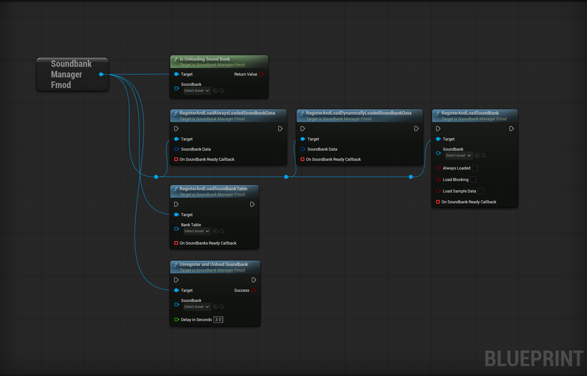
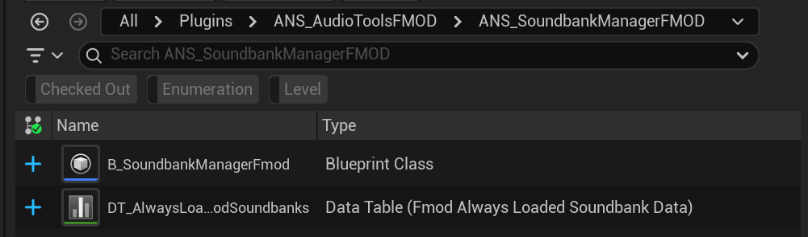
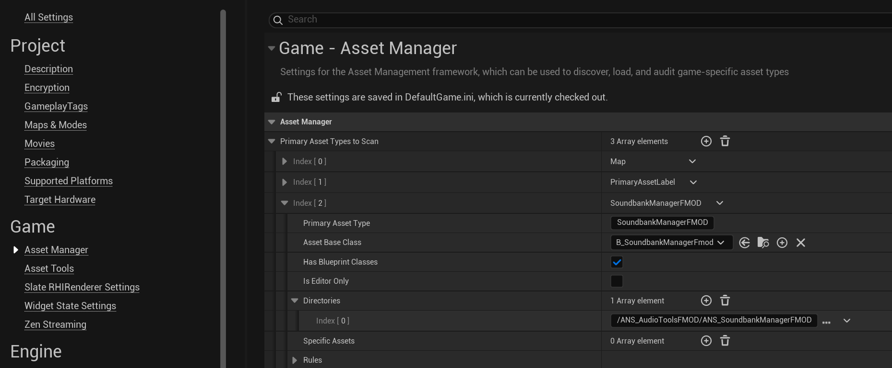
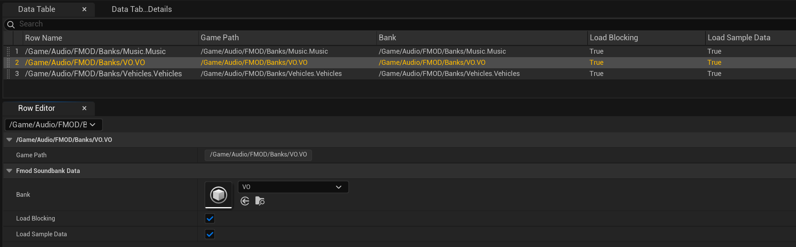
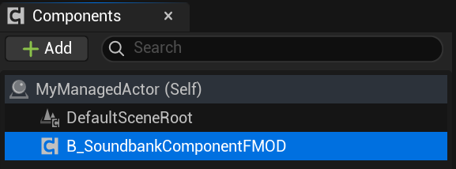

# ANS_SoundbankManagerFMOD

Runtime plugin for managing FMOD soundbanks in Unreal Engine through a Game Instance subsystem.

## Features

Provides a Game Instance subsystem and an actor component for FMOD soundbank management:

- Integration with FMOD Studio official Unreal integration plugin
- Load and unload FMOD soundbanks at runtime with usage tracking
- Always loaded soundbanks, and dynamically loaded soundbanks
- Automatic unloading of soundbanks when the usage count reaches zero
- Support for blocking or asynchronous loading/unloading with callbacks

## Usage

1. Add ANS_AudioToolsFMOD folder inside your project's Plugins directory
2. Add ANS_SoundbankManagerFMOD to your project's Build.cs file
3. Run the editor and compile the plugin
4. Go to Edit > Plugins and verify ANS_AudioToolsFMOD is enabled
5. Go to Project Settings > Game > Asset Manager and add B_SoundbankManagerFmod to the list of primary asset types to scan

5. Add entries to DT_AlwaysLoadedFmodSoundbanks for persistent soundbanks

6. Add SoundbankComponentFmod to any actor that needs dynamic soundbank management

### Common Workflows

**Always loaded soundbanks:**

1. Add soundbanks to the DT_AlwaysLoadedFmodSoundbanks
2. Define loading behavior (blocking or asynchronous) in the structs

**Load a dynamically loaded soundbank:**
1. Create a blueprint child of SoundbankComponentFmod
2. Add your new component to any actor that needs dynamic soundbank management
3. Fill its data struct with the desired soundbank path and loading behavior
4. When actors are spawned or activated, the soundbank will be loaded and its usage count incremented
5. When the counter reaches zero (actor destruction or manual unregistration), the soundbank will be unloaded automatically

### Note

- Requires FMOD Studio integration plugin

## Credits

Created by Horacio Valdivieso - Above Noise Studios