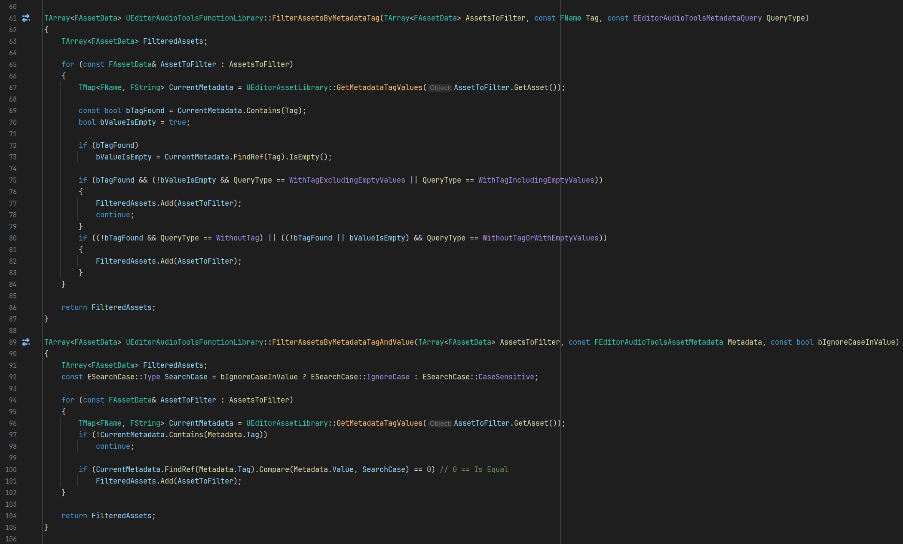


### Unreal Engine Audio Tools
A collection of Unreal Engine C++ and Blueprint utilities for the technical audio working human.

## Overview

Runtime and editor plugins providing practical solutions for audio implementation, asset management, and metadata manipulation in Unreal Engine.
Primarily designed for technical audio work, but useful across disciplines.

Each module includes a `readme.md` with detailed functionality information.

## Installation

1. Copy the desired plugin into your project's `Plugins` folder (create if needed)
2. Open your project in Unreal Editor
3. Enable the plugin: **Edit → Plugins → Audio**
4. Restart the editor when prompted

## Modules

**`ANS_AudioToolsUE`**
- `ANS_EditorAudioToolsUE`: C++ functions and Editor Utility Blueprints for asset auditing and metadata manipulation

for more information about Unreal Engine plugins please read the official documentation:\
https://dev.epicgames.com/documentation/en-us/unreal-engine/plugins-in-unreal-engine?application_version=5.7

## Credits

Created by Horacio Valdivieso - Above Noise Studios